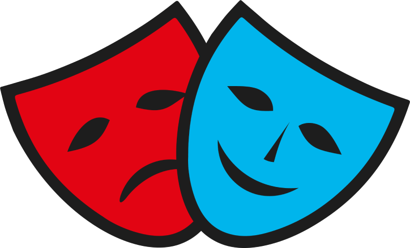

<h1 align="center">
  <br>
  
  <br>
  Одеська театральна школа
  <br>
</h1>

<h3 align="center">Школа, в яку діти завжди йдуть із задоволенням!</h3>

<p align="center">
  <a href="https://teatralo4ka.odesa.ua/">🌐 Перейти на сайт</a>
</p>

---

## 🎭 Про школу

Одеська театральна школа — заклад мистецької освіти для дітей та молоді в Одесі. Ми пропонуємо творчий розвиток, концертну діяльність та всебічне розкриття талантів через театральне мистецтво, музику, спів та живопис.

---

## 🎼 Відділення

| Відділення | Напрямки |
|------------|----------|
| 🎭 **Театральне** | Акторська майстерність, сценічна мова, танець |
| 🎵 **Музичне** | Вокал, хор, фортепіано, гітара |
| 🎨 **Художнє** | Живопис, композиція, малювання |
| ✨ **Відділення естетичного виховання** | Розвиток смаку, етикету, творчого мислення та культурної впевненості |

---

## 🎓 Для вступу

Запрошуємо дітей та молодь до вступу! Детальна інформація про умови, документи та програми навчання — на [сторінці вступу](https://teatralo4ka.odesa.ua/admission).

---

## 📞 Контакти

| | |
|---|---|
| 📍 **Адреса** | [вул. Софіївська, 24, Одеса](https://maps.google.com/?q=вул.+Софіївська,+24,+Одеса) |
| 📞 **Директор** | [+380 48 723 61 01](tel:+380487236101) |
| 📞 **Секретар** | [+380 48 723 61 02](tel:+380487236102) |
| 📞 **Завуч** | [+380 48 723 61 03](tel:+380487236103) |
| 📞 **Вахта** | [+380 48 723 61 04](tel:+380487236104) |
| 📧 **Email** | [teatr_school@i.ua](mailto:teatr_school@i.ua) |

---

## 🌐 Ми в соціальних мережах

<p align="center">
  <a href="https://www.facebook.com/groups/CTS.od.ua/">Facebook</a> •
  <a href="https://www.instagram.com/teatralo4ka_official_/">Instagram</a> •
  <a href="https://t.me/teatralo4ka_official">Telegram</a> •
  <a href="https://www.youtube.com/user/dtschool/">YouTube</a> •
  <a href="https://www.tiktok.com/@teatralo4ka_official/">TikTok</a>
</p>

---

## 📰 Проєкти

- 🎬 [**Театр-про**](https://teatralo4ka.odesa.ua/projects/teatr-pro) — Театральний проєкт школи
- 📸 [**Фотоархів**](https://teatralo4ka.odesa.ua/projects/photo-archive) — Фотолітопис шкільного життя
- 💛 [**Підтримати постановку**](https://teatralo4ka.odesa.ua/projects/support-production) — Благодійна підтримка

---

## 📖 Корисні посилання

- [🏠 Головна сторінка](https://teatralo4ka.odesa.ua/)
- [📜 Історія школи](https://teatralo4ka.odesa.ua/history)
- [🎭 Про школу](https://teatralo4ka.odesa.ua/about)
- [📰 Новини та події](https://teatralo4ka.odesa.ua/news)
- [🎓 Для вступу](https://teatralo4ka.odesa.ua/admission)
- [📞 Контакти](https://teatralo4ka.odesa.ua/contacts)

---

## 🛠️ Для розробників

Сайт на SvelteKit 2 + Svelte 5 (виключно руни), профіль `static`. Серверного
рантайму немає: ні form actions, ні `+server.ts`, ні `hooks.server.ts`. Дані —
з Firestore на клієнті й із пререндереного вмісту.

**Адреса.** 🌐 **https://teatralo4ka.odesa.ua/** — куплений власний домен. Це один
із двох проєктів екосистеми з власним доменом (другий — `as5.odesa.ua`), решта
живуть на спільному `alik532ua.github.io`.

Звідси `paths.base = ''`: сторінки лежать у корені домену. Файл `static/CNAME`
не потрібен — деплой іде офіційним `actions/deploy-pages`, який зберігає
прив'язку домену з налаштувань Pages. Префікс сховища `teatralo4ka_` лишається
попри окремий origin: проєкт може переїхати, а дані мають пережити переїзд.

Набір граблів такого переїзду — [CUSTOM-DOMAIN-v8.md](../sveltekit-canon/selection_criteria/v8/ops/CUSTOM-DOMAIN-v8.md).

### Швидкий старт

```bash
npm ci
```

```bash
npm run dev
```

Порт dev-сервера — **5194**, перегляду збірки — **5196** (конфігурації
`teatr-dev` і `teatr-preview` у `.claude/launch.json` кореневої теки `GitHub`).

### Команди

| Команда | Що робить |
|---|---|
| `npm run check` | `svelte-check` — має бути 0 помилок |
| `npm run lint` | ESLint — 0 помилок (попередження — записаний борг) |
| `npm test` | юніт-інваріанти (Vitest) |
| `npm run build` | збірка; `prebuild` валідує контент, `postbuild` жене sitemap, бюджет бандла й перевірку биті посилань |
| `npm run test:e2e` | Playwright проти **зібраного** сайту (спершу робить `build`) |
| `npm run bump-version` | підняття версії; окремо кликати не треба — те саме жене `.husky/pre-commit` перед кожним комітом |

### Що варто знати перед першою правкою

- **Мовний префікс — це `reroute`, а не група маршрутів.** `/en/about`
  рендериться маршрутом `/about` (хук у `src/hooks.ts`). Каталогів `[[lang]]`
  немає й не має з'явитися.
- **Усе з Firestore проходить `zod`-схему** зі `src/lib/schemas/`. Схеми
  відкидають непридатне й нічого не підставляють — типові значення живуть в
  одному місці, у `DEFAULT_*`.
- **HTML із бази — лише через `isomorphic-dompurify`.** Звичайний `dompurify`
  падає під час пререндеру.
- **Префікс сховища** — `teatralo4ka_`, єдине джерело `src/lib/config/storage.ts`.
- **Компонентних тестів немає** — монтувати `.svelte` тут нічим. Не пиши тестів,
  що рендерять компоненти.

Частину дефектів видно **лише** у `build/` — саме тому `postbuild` існує окремо.
Результат треба побачити, а не припустити.

### Стандарти

Загальні правила — у пакеті [`sveltekit-canon/selection_criteria/v8`](../sveltekit-canon/selection_criteria/v8/README.md).
Специфіка проєкту — в [PROJECT-CONTEXT.md](PROJECT-CONTEXT.md), інструкції для
AI-асистентів — в [AGENTS.md](AGENTS.md).

---

<p align="center">
  <sub>© Одеська театральна школа</sub>
</p>
